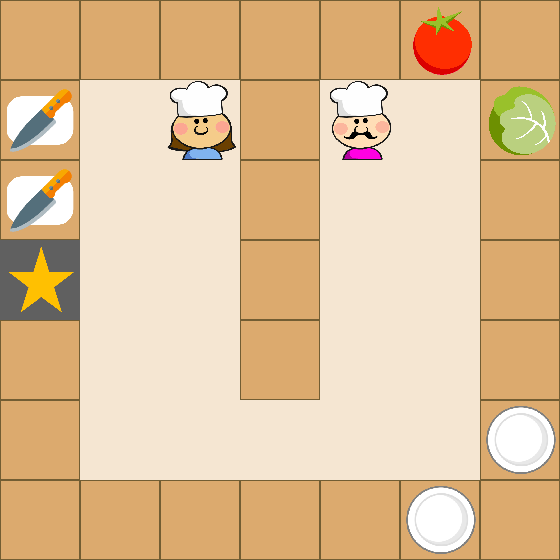
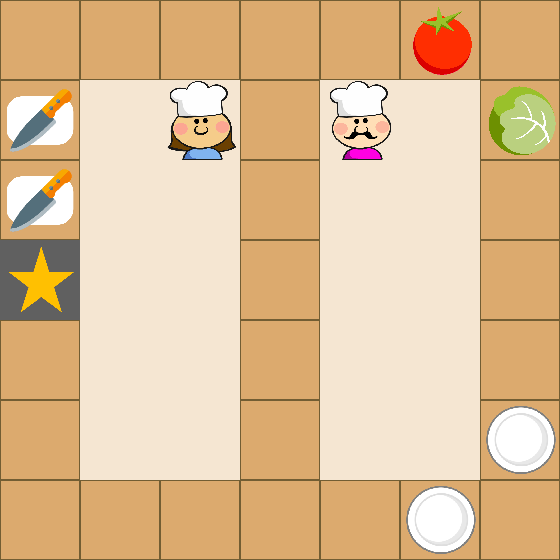
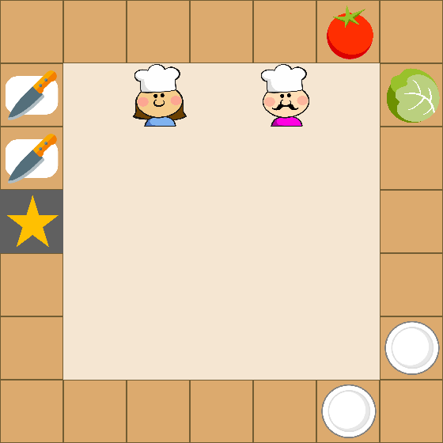
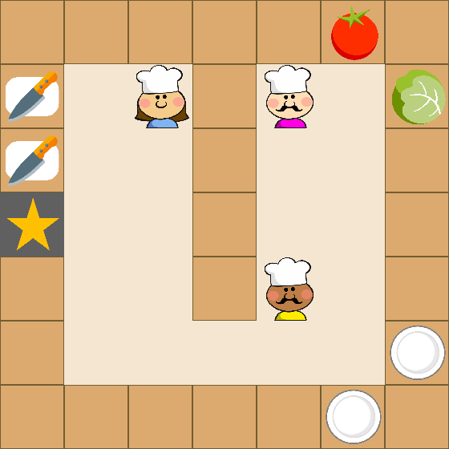
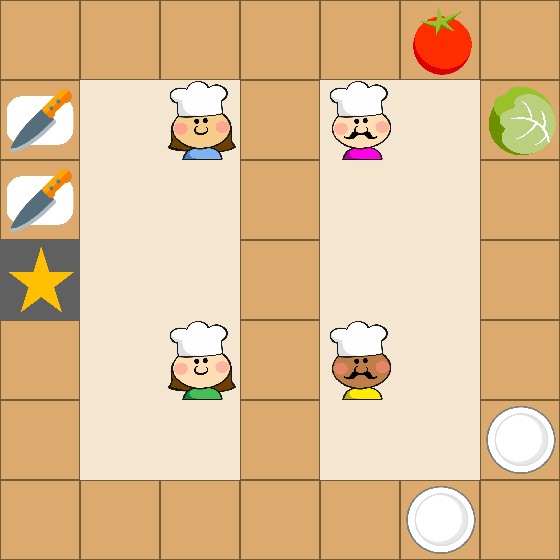
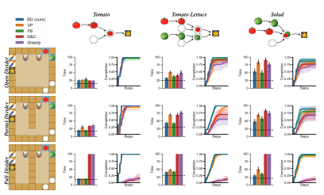
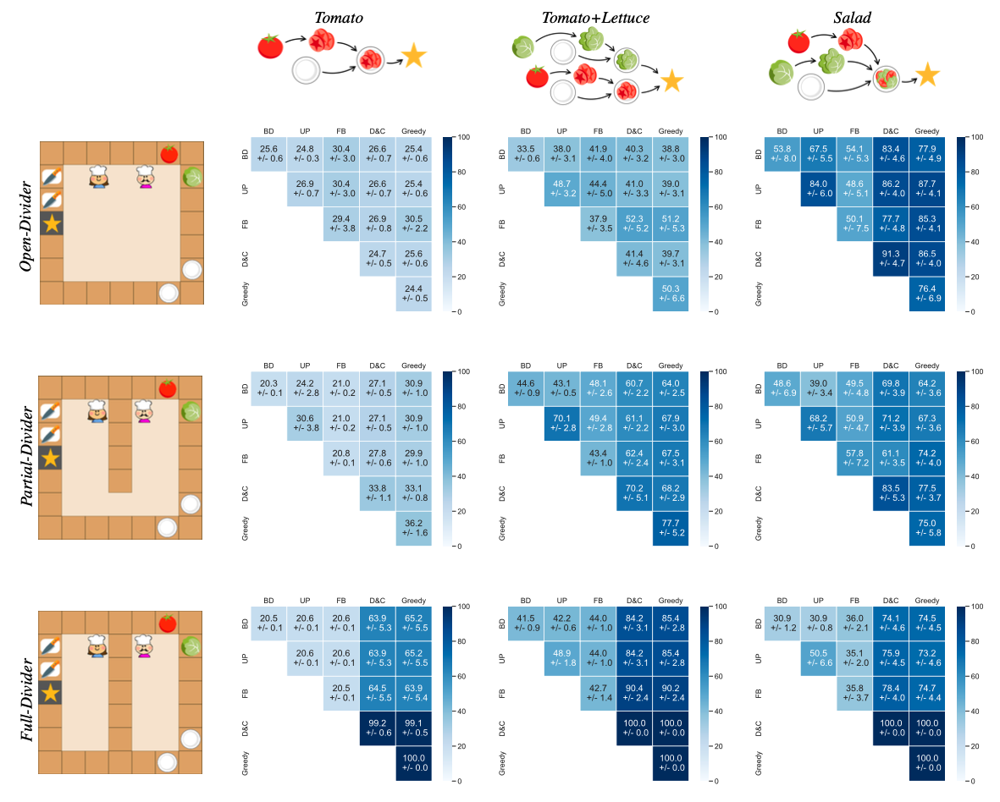

# Code for OvercookedEnvironment (gym-cooking) and "Too many cooks: Bayesian inference for coordinating multi-agent collaboration"

[[Full paper]](https://arxiv.org/abs/2003.11778) [[Journal paper]](https://onlinelibrary.wiley.com/doi/10.1111/tops.12525) [[Video]](https://www.youtube.com/watch?v=Fd4RcVaNthY&ab_channel=RoseWang)

Code for "Too many cooks: Bayesian inference for coordinating multi-agent collaboration", Winner of the CogSci 2020 Computational Modeling Prize in High Cognition, and a NeurIPS 2020 CoopAI Workshop Best Paper. 


Contents:
- [Introduction](#introduction)
- [Installation](#installation)
- [Usage](#usage)
- [Environments and Recipes](docs/environments.md)
- [Design and Customization](docs/design.md)

## Introduction

<p align="center">
    </img>
    </img>
    </img>
</p>

Collaboration requires agents to coordinate their behavior on the fly, sometimes cooperating to solve a single task together and other times dividing it up into sub-tasks to work on in parallel. Underlying the human ability to collaborate is theory-of-mind, the ability to infer the hidden mental states that drive others to act. Here, we develop Bayesian Delegation, a decentralized multi-agent learning mechanism with these abilities. Bayesian Delegation enables agents to rapidly infer the hidden intentions of others by inverse planning. We test Bayesian Delegation in a suite of multi-agent Markov decision processes inspired by cooking problems. On these tasks, agents with Bayesian Delegation coordinate both their high-level plans (e.g. what sub-task they should work on) and their low-level actions (e.g. avoiding getting in each other’s way). In a self-play evaluation, Bayesian Delegation outperforms alternative algorithms. Bayesian Delegation is also a capable ad-hoc collaborator and successfully coordinates with other agent types even in the absence of prior experience. Finally, in a behavioral experiment, we show that Bayesian Delegation makes inferences similar to human observers about the intent of others. Together, these results demonstrate the power of Bayesian Delegation for decentralized multi-agent collaboration.

You can use this bibtex if you would like to cite this work (Wu and Wang et al., 2021):
```
@article{wu_wang2021too,
  author = {Wu, Sarah A. and Wang, Rose E. and Evans, James A. and Tenenbaum, Joshua B. and Parkes, David C. and Kleiman-Weiner, Max},
  title = {Too many cooks: Coordinating multi-agent collaboration through inverse planning},
  journal = {Topics in Cognitive Science},
  year = {2021},
  volume = {n/a},
  number = {n/a},
  keywords = {Coordination, Social learning, Inverse planning, Bayesian inference, Multi-agent reinforcement learning},
  doi = {https://doi.org/10.1111/tops.12525},
  url = {https://onlinelibrary.wiley.com/doi/abs/10.1111/tops.12525},
}
```

## Installation

You can install the dependencies with `pip3`:
```
git clone https://github.com/rosewang2008/gym-cooking.git
cd gym-cooking
pip3 install -e .
```

All experiments have been run with `python3`! 

## Usage 

Here, we discuss how to run a single experiment, run our code in manual mode, and re-produce results in our paper. For information on customizing environments, observation/action spaces, and other details, please refer to our section on [Design and Customization](docs/design.md)

For the code below, make sure that you are in **gym-cooking/gym_cooking/**. This means, you should be able to see the file `main.py` in your current directory.

<p align="center">
    </img>
    </img>
    </img>
</p>

### Running an experiment 

The basic structure of our commands is the following:

`python main.py --num-agents <number> --level <level name> --model1 <model name> --model2 <model name> --model3 <model name> --model4 <model name>`

where `<number>` is the number of agents interacting in the environment (we handle up to 4 agents), `level name` are the names of levels available under the directory `cooking/utils/levels`, omitting the `.txt`.

The `<model name>` are the names of models described in the paper. Specifically `<model name>` can be replaced with:
* `bd` to run Bayesian Delegation,
* `up` for Uniform Priors,
* `dc` for Divide & Conquer,
* `fb` for Fixed Beliefs, and 
* `greedy` for Greedy.

For example, running the salad recipe on the partial divider with 2 agents using Bayesian Delegation looks like:
`python main.py --num-agents 2 --level partial-divider_salad --model1 bd --model2 bd`

Or, running the tomato-lettuce recipe on the full divider with 3 agents, one using UP, one with D&C, and the third with Bayesian Delegation:
`python main.py --num-agents 2 --level full-divider_tl --model1 up --model2 dc --model3 bd`

Although our work uses object-oriented representations for observations/states, the `OvercookedEnvironment.step` function returns *image observations* in the `info` object. They can be retrieved with `info['image_obs']`.  

### Additional commands

The above commands can also be appended with the following flags:
* `--record` will save the observation at each time step as an image in `misc/game/record`.

### Manual control

To manually control agents and explore the environment, append the `--play` flag to the above commands. Specifying the model names isn't necessary but the level and the number of agents is still required. For instance, to manually control 2 agents with the salad task on the open divider, run:

`python main.py --num-agents 2 --level open-divider_salad --play`

This will open up the environment in Pygame. Only one agent can be controlled at a time -- the current active agent can be moved with the arrow keys and toggled by pressing `1`, `2`, `3`, or `4` (up until the actual number of agents of course). Hit the Enter key to save a timestamped image of the current screen to `misc/game/screenshots`.

### Reproducing paper results

To run our full suite of computational experiments (self-play and ad-hoc), we've provided the scrip `run_experiments.sh` that runs our experiments on 20 seeds with `2` agents.

To run on `3` agents, modify `run_experiments.sh` with `num_agents=3`.

### Creating visualizations

To produce the graphs from our paper, navigate to the `gym_cooking/misc/metrics` directory, i.e. 

1. `cd gym_cooking/misc/metrics`.

To generate the timestep and completion graphs, run:

2. `python make_graphs.py --legend --time-step`
3. `python make_graphs.py --legend --completion`

This should generate the results figures that can be found in our paper.

Results for homogenous teams (self-play experiments):


Results for heterogeneous teams (ad-hoc experiments):

