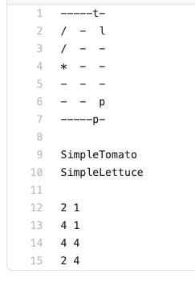
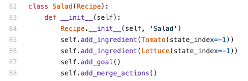

# Design and Customization of the environment

This document discusses the design of our Overcooked environment. We design the environment with the intentionality for it to be easy to customize---whether it's to make the environments larger/smaller or more complex/more easy.

Contents:
- [Design](#design)
- [Customization](#customization)

## Design

We design our enviornment such that the environment never has direct access to the real agent objects (which perform task inference and planning).

Thus, there are two main components in the environment. One is the world object which contains the counter tops, ingredients, etc. The other is the simulated agent objects, which track the position of an agent, whether the agent is holding an object, etc.

### World (`gym_cooking/utils/world.py`)

`world.py` tracks the objects in `self.objects`, which maps object names to the list of those objects.

### Simulated agent (`gym_cooking/utils/agent.py`)

The `SimAgent` object is the simulated agent which interacts with the world objects. It tracks its corresponding real agent's name, location, held object (if any), and most recent action.

## Customization

This section describes how you can create your own environments and recipes.

### Customize environments

The kitchen environments are created based on txt files under `gym_cooking/utils/levels/`, which are parsed into environment objects in `gym_cooking/envs/overcooked_environment.py` under the function `load_level`.

There are three components in each txt file needed for correct parsing. We're using `full-divider_tl.txt` as a running example. 

    </img>

1. The level layout (Line 1-7).
    * `-` and `|` are converted into counters.
    * `p`, `t`, `l`, `o` are converted into plates, tomatoes, lettuces, and onions respectively.
    * `/` is converted into cutting boards.
    * `*` is converted into delivery stations.
2. The recipe (Line 9-10).
    * The names, e.g. `SimpleTomato`, correspond to the recipe class names under `gym_cooking/recipe_planner/recipe.py`.
3. The agent locations (Line 12-15).
    * We list out 4 agent locations since our environments can handle up to 4 agents.

Each component must be separated between each other by a line (Line 8, 11).

### Customize recipes

Recipes can be customized and added to `gym_cooking/recipe_planner/recipe.py`. 

There are three main components to customizing the recipe. We will use the Salad recipe as a running example. 

1. Adding ingredients (Line 85-86).
    * Ingredient objects can be specified under `gym_cooking/utils/core.py`.
2. Adding the goal (Line 87).
    * This just creates the finished recipe object, which is the goal of each recipe.
3. Adding merge actions (Line 88).
    * This specifies the merge operator applied onto the ingredients that need to be combined for the recipe.

    </img>

